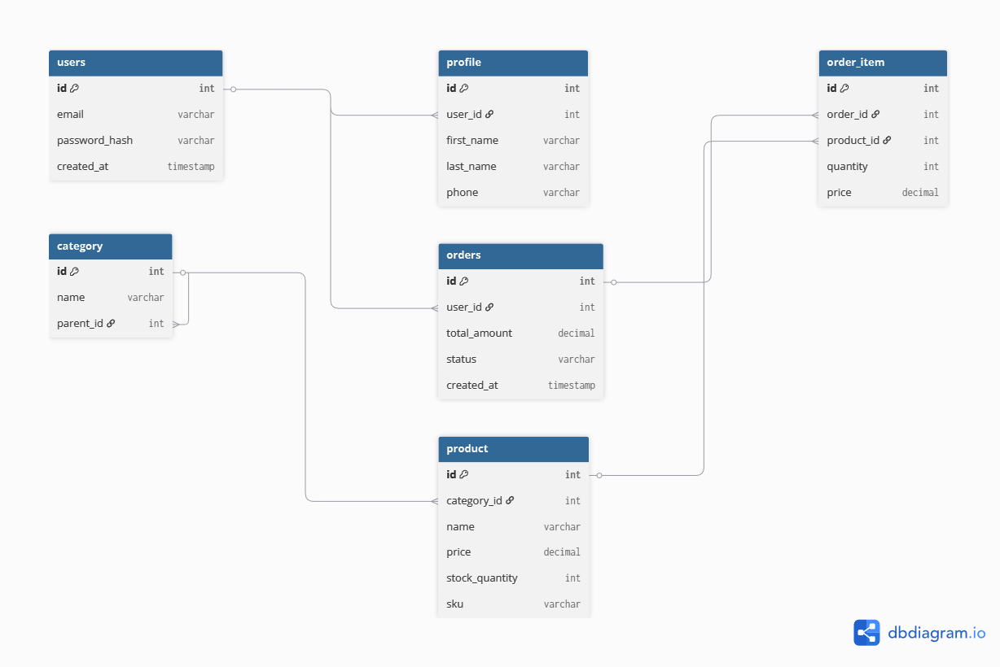

# Лабораторна робота 1: Збір вимог та розробка ER-діаграми

## 1. Вимоги для системи

### 1.1 Дані для зберігання
Система повинна зберігати інформацію про наступні об'єкти предметної області:
* **Користувачі:** Базова інформація для авторизації, спільна для всіх ролей (покупці, продавці, адміністратори).
* **Профілі покупців:** Персональні дані (ім'я, контакти), необхідні для оформлення замовлень.
* **Профілі продавців:** Бізнес-дані (магазин, податковий номер, рейтинг) для ведення торгівлі.
* **Адміністратори:** Дані про співробітників платформи та їх рівні доступу.
* **Адреси:** Збережені адреси користувачів для швидкого оформлення доставки.
* **Категорії:** Ієрархічна структура для класифікації товарів.
* **Товари:** Інформація про продукти, їх ціни, артикули, описи та поточний стан.
* **Історія цін:** Хронологія змін вартості товарів.
* **Замовлення:** Інформація про транзакції, включаючи статус, суму та знімок адреси доставки.
* **Позиції замовлення:** Деталізація вмісту кожного замовлення (товари та їх кількість).
* **Платежі:** Статус та деталі фінансових транзакцій.
* **Відгуки:** Оцінки та коментарі користувачів щодо товарів.

### 1.2 Бізнес-правила (Функціональні вимоги)
* **Єдина авторизація:** Всі користувачі (Покупець, Продавець, Адмін) входять у систему через єдину сутність User (email + password).
* **Рольова модель:** Кожен користувач має певну роль, яка визначає наявність відповідного профілю (Buyer, Seller або Admin).
* **Soft Delete:** Видалення користувачів або товарів не призводить до фізичного знищення записів у БД. Замість цього встановлюється мітка часу видалення (deleted_at).
* **Управління адресами:** Покупець може зберігати кілька адрес у профілі.
* **Фіксація адреси (Snapshot):** Адреса доставки копіюється в замовлення як текстовий знімок на момент покупки.
* **Верифікація продавця:** Товари продавця стають доступними тільки після підтвердження профілю адміністратором.
* **Складський облік:** При замовленні кількість товару резервується.
* **Оптимістичне блокування:** Редагування товару захищене версійністю (version).
* **Фіксація цін:** Ціна товару фіксується в момент створення замовлення.
* **Відгуки:** Залишати відгуки можуть лише покупці, які купили товар.

## 2. Сутності та атрибути

### User (Користувач)
* `id`: (PK) — Унікальний ідентифікатор.
* `email`: (Unique, Not Null) — Логін.
* `password_hash`: (Not Null) — Хеш пароля.
* `created_at`: Дата реєстрації.
* `deleted_at`: (Nullable) — Дата логічного видалення.

### Buyer (Профіль Покупця)
* `id`: (PK)
* `user_id`: (FK -> User.id)
* `first_name`, `last_name`: ПІБ.
* `phone`: Телефон.

### Seller (Профіль Продавця)
* `id`: (PK)
* `user_id`: (FK -> User.id)
* `store_name`: Назва магазину.
* `tax_id`: Податковий номер.
* `iban`: Рахунок.
* `is_verified`: Статус перевірки.

### Administrator (Профіль Адміна)
* `id`: (PK)
* `user_id`: (FK -> User.id)
* `full_name`: ПІБ.
* `access_level`: Рівень доступу ('SUPER', 'MODERATOR').

### Product (Товар)
* `id`: (PK)
* `seller_id`, `category_id`: (FK)
* `name`, `description`: Опис товару.
* `price`: Поточна ціна.
* `stock_quantity`: Залишок.
* `sku`: Артикул.
* `version`: Для блокування.

### Order (Замовлення)
* `id`: (PK)
* `buyer_id`: (FK)
* `total_amount`: Сума.
* `status`: ('PENDING', 'PAID', 'SHIPPED', 'DELIVERED', 'CANCELLED').

*(Інші сутності: Category, Address, ProductPriceHistory, OrderItem, Payment, Shipment, Review - описані в діаграмі)*

## 3. Зв'язки між сутностями
* User - Profiles (1:1)
* User - Addresses (1:N)
* Seller - Products (1:N)
* Category - Category (1:N)
* Buyer - Orders (1:N)
* Order - OrderItems (1:N)
* Product - OrderItems (1:N)
* Order - Payment (1:N)
* Order - Shipment (1:1)

## 4. ER-Діаграма


## Додаток: SQL скрипт створення таблиць
```sql
  
CREATE TABLE users (
    id SERIAL PRIMARY KEY,
    email VARCHAR(255) NOT NULL UNIQUE,
    password_hash VARCHAR(255) NOT NULL,
    created_at TIMESTAMP DEFAULT CURRENT_TIMESTAMP
);

CREATE TABLE profile (
    id SERIAL PRIMARY KEY,
    user_id INT NOT NULL UNIQUE,
    first_name VARCHAR(100),
    last_name VARCHAR(100),
    phone VARCHAR(20),
    FOREIGN KEY (user_id) REFERENCES users(id) ON DELETE CASCADE
);

CREATE TABLE category (
    id SERIAL PRIMARY KEY,
    name VARCHAR(255) NOT NULL,
    parent_id INT,
    FOREIGN KEY (parent_id) REFERENCES category(id)
);

CREATE TABLE product (
    id SERIAL PRIMARY KEY,
    category_id INT NOT NULL,
    name VARCHAR(255) NOT NULL,
    price DECIMAL(10, 2) NOT NULL CHECK (price > 0),
    stock_quantity INT DEFAULT 0,
    sku VARCHAR(100) UNIQUE,
    FOREIGN KEY (category_id) REFERENCES category(id)
);

CREATE TABLE orders (
    id SERIAL PRIMARY KEY,
    user_id INT NOT NULL,
    total_amount DECIMAL(12, 2) NOT NULL,
    status VARCHAR(50) DEFAULT 'PENDING',
    created_at TIMESTAMP DEFAULT CURRENT_TIMESTAMP,
    FOREIGN KEY (user_id) REFERENCES users(id)
);

CREATE TABLE order_item (
    id SERIAL PRIMARY KEY,
    order_id INT NOT NULL,
    product_id INT NOT NULL,
    quantity INT NOT NULL CHECK (quantity > 0),
    price DECIMAL(10, 2) NOT NULL,
    FOREIGN KEY (order_id) REFERENCES orders(id),
    FOREIGN KEY (product_id) REFERENCES product(id)
);
CREATE TABLE users ...
...