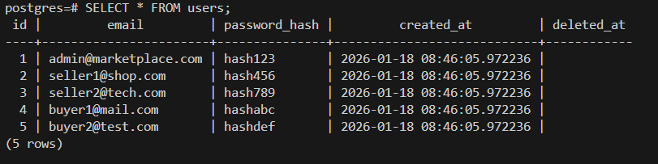
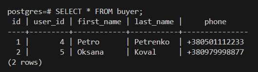
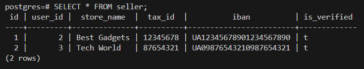
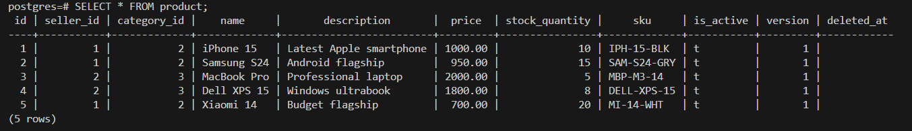
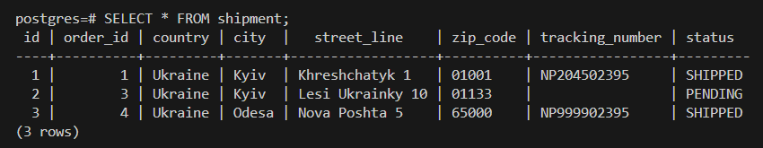
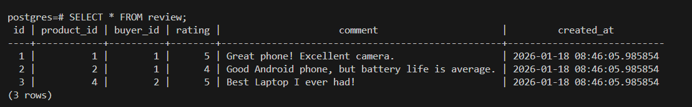

# Лабораторна робота №2: Реалізація схеми БД

## 1. Схема бази даних (DDL)
Було реалізовано розширену схему бази даних, що включає підтримку доставки (`shipments`), платежів (`payments`), історії цін (`product_price_history`) та відгуків (`reviews`).
Код створення таблиць: [ddl.sql](./ddl.sql)

## 2. Наповнення даними (DML)
Базу наповнено тестовими даними для перевірки всіх зв'язків. Використано реальні приклади товарів та користувачів.
Код наповнення: [dml.sql](./dml.sql)

## 3. Результати роботи (Скріншоти)

### Користувачі та Профілі (Users, Buyers, Sellers)

### Товари (Products)

### Замовлення та Доставка (Orders & Shipments)

### Відгуки (Reviews)
