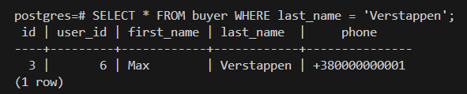
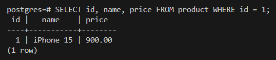
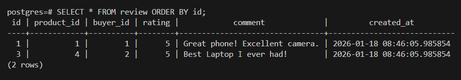
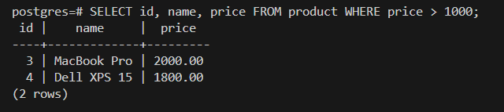

# Лабораторна робота №3: Маніпулювання даними (DML)

## 1. Мета роботи
Ознайомлення з операторами маніпулювання даними (`INSERT`, `UPDATE`, `DELETE`, `SELECT`) в PostgreSQL.

## 2. Виконання запитів
Всі запити зібрані у файлі [lab3.sql](./lab3.sql). Нижче наведено результати виконання основних операцій.

### 2.1. Вставка даних (INSERT)
Було додано нового користувача та новий товар.
**Результат:**

### 2.2. Оновлення даних (UPDATE)
Було змінено ціну товару "iPhone 15" та оновлено статус замовлення.
**Результат:**

### 2.3. Видалення даних (DELETE)
Було видалено відгук з `id=2`. Перевірка показує, що запис відсутній у таблиці.
**Результат:**

### 2.4. Вибірка даних (SELECT)
Приклад вибірки дорогих товарів (> 1000 у.о.):
**Результат:**
