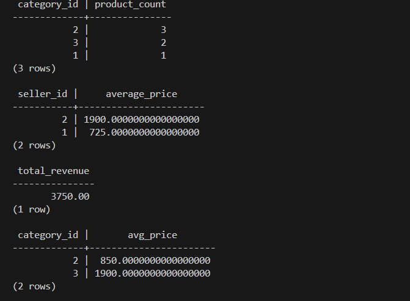
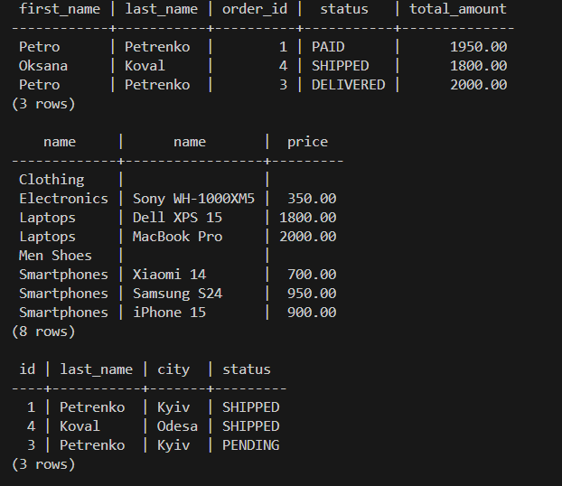
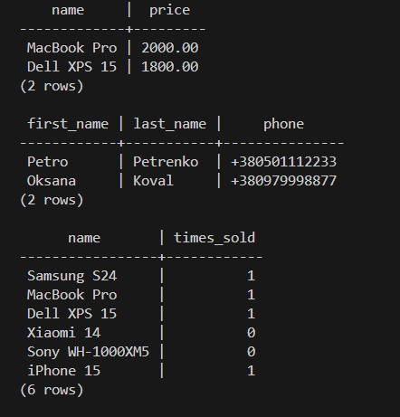

# Лабораторна робота №4: Аналітичні запити (OLAP)

## 1. Агрегація та групування
Використано функції `COUNT`, `SUM`, `AVG` та `GROUP BY` для отримання статистики магазину.

**Виконані запити:**
1. Підрахунок кількості товарів у кожній категорії.
2. Середня ціна товарів у кожного продавця.
3. Загальна виручка (сума успішних платежів).
4. Категорії, де середня ціна товару перевищує 500 (фільтрація через `HAVING`).

**Результат:**

## 2. Робота з JOIN (Об'єднання таблиць)
Використано `INNER JOIN`, `LEFT JOIN` та множинні об'єднання для зв'язування даних.

**Виконані запити:**
1. Список покупців та їхніх замовлень (`INNER JOIN`).
2. Список категорій та товарів, включаючи пусті категорії (`LEFT JOIN`).
3. Повна інформація про доставку: замовлення + покупець + адреса (`MULTI JOIN`).

**Результат:**

## 3. Використання підзапитів
Реалізовано вкладені запити в операторах `SELECT`, `WHERE` та `IN`.

**Виконані запити:**
1. Товари, ціна яких вища за середню по всій базі.
2. Покупці, які зробили хоча б одне замовлення (`IN`).
3. Кількість продажів кожного конкретного товару (підзапит у `SELECT`).

**Результат:**
