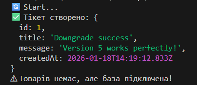

# Лабораторна робота №6: Робота з ORM Prisma

## Мета роботи
Налаштувати ORM Prisma для роботи з існуючою базою даних PostgreSQL, виконати міграції схеми даних та перевірити роботу через JS-скрипт.

## Виконані кроки

### 1. Налаштування середовища
- Ініціалізовано проект Node.js у папці `lab6`.
- Встановлено стабільну версію **Prisma v5.22.0** для забезпечення сумісності з локальним середовищем.
- Налаштовано `DATABASE_URL` у файлі `.env`.

### 2. Міграції бази даних
Було застосовано наступні зміни до схеми:
1.  **Створено таблицю `Ticket`** (поля: `id`, `title`, `message`, `createdAt`).
2.  **Оновлено таблицю `Product`**: додано поле `inStock` та видалено застаріле поле `description`.

### 3. Перевірка
Запущено скрипт `index.js`, який успішно ініціалізував `PrismaClient` та записав дані у нову таблицю.

## Результат виконання
Нижче наведено скріншот терміналу, що підтверджує успішне створення запису в базі даних:

